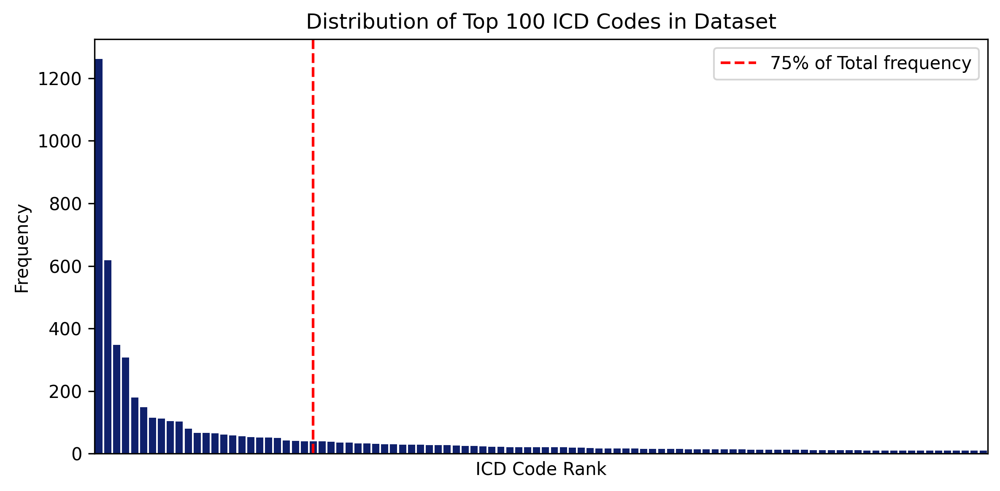
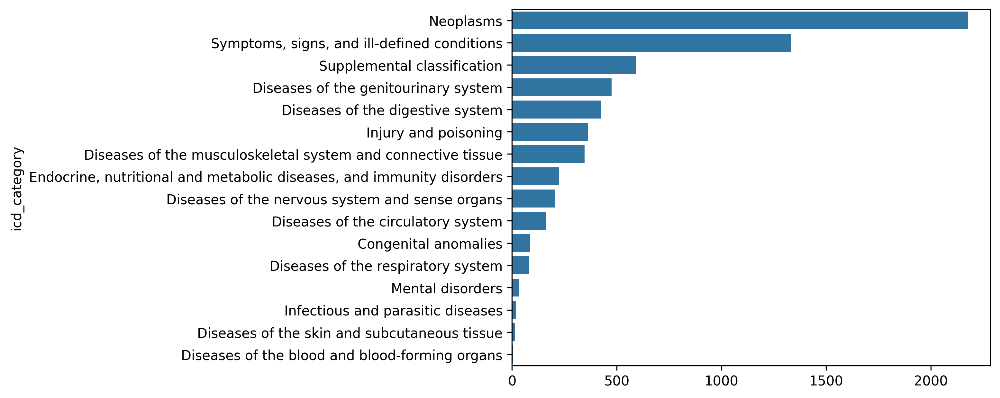

🩺 ICD Code Mapping Dataset Overview

#### Dataset Cleaning
The synthetic dataset consists of approximately 6,500 clinical diagnosis entries. To detect potential mismatches between clinical notes and their assigned ICD codes, we compute the cosine similarity between the embeddings of each clinical note and its corresponding ICD-9-CM description.

If the similarity score falls below a defined threshold τ, the entry is flagged as potentially incorrect. A manual review process is then performed to validate or reassign the code. This cleaning process revealed that around 35% of the original entries were misaligned and required correction.

#### ICD Code Matching Pipeline
The ICD mapping pipeline consists of several components:

🔄 LLM Standardizer
Clinical notes (originally in Italian) are standardized to English using LLaMA 3.1 8B, with prompts tailored to align output with ICD-compatible terminology. This standardization step substantially improved retrieval accuracy.

🔍 RAG Component (Retrieval-Augmented Generation)
A SentenceTransformer model (`pritamdeka/BioBERT-mnli-snli-scinli-scitail-mednli-stsb`) is used to embed both the LLM-standardized clinical notes and ICD descriptions. The ICD descriptions are stored in a FAISS index to enable fast top-5 nearest-neighbor retrieval.

⚠️ Ambiguity Detection and LLM Reranking
If the retrieval is ambiguous—e.g., low variance across top-k similarity scores or an insufficient top score—an LLM-based reranker is triggered. This reranker receives the query and top retrieved candidates, and outputs a semantically reranked list using its internal clinical reasoning.

| Metric                                                 | Value  |
| ------------------------------------------------------ | ------ |
| **Top-1 Accuracy**                                     | 80.45% |
| **Top-5 Accuracy**                                     | 91.97% |
| **Mean Reciprocal Rank (MRR)**                         | 0.8546 |
| **Top-1 Hierarchical Accuracy** (3-digit ICD match) | 91.47% |

🔢 Code Distribution

The distribution of the top 100 ICD codes exhibits a long-tail pattern, with a small number of codes dominating the dataset. Notably, around 20 codes account for 75% of all records.

🧬 ICD Category Distribution

