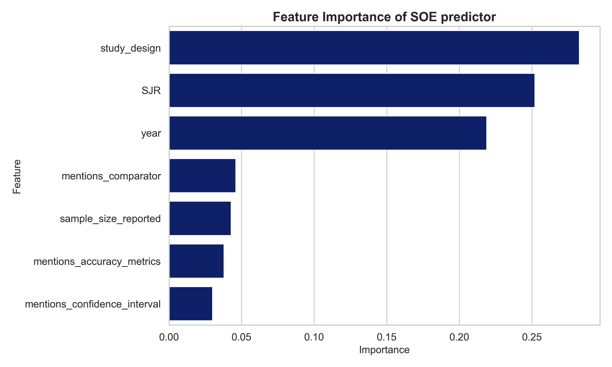

## 📚 Medical Literature Retrieval Pipeline

To evaluate whether our system generalizes beyond ACR-covered conditions, we replicate the ACR evidence-gathering approach by issuing expert-informed keyword searches to PubMed.

We deploy **[DeepRetrieval-PubMed-3B](https://huggingface.co/DeepRetrieval/DeepRetrieval-PubMed-3B)** for LLM-based query rewriting and conduct testing on various clinical scenarios.

> 🔧 Run locally using: `vllm_host.sh`

---

### 🔍 Query Expansion Strategy

Effective query formulation was key. We followed a structured prompting strategy:

1. **Expand the core condition**
2. **Add synonyms and related terms**
3. **Inject imaging-specific terminology**
4. **Leverage clinical frameworks like PICO**


### 🧪 Example: Breast Pain

Some generated (cleaned) DeepRetrieval Boolean queries:
```
(Breast Pain OR Mastitis)
(Breast Pain OR Mastalgia OR Imaging OR Mammography OR Magnetic Resonance Imaging OR Ultrasound Imaging OR Breast Imaging)
(Breast Pain OR Mastalgia OR Imaging Imaging OR Mammography OR Magnetic Resonance Imaging OR Ultrasound Imaging OR Breast Imaging OR Mastodynosis)
(Breast Pain OR Mastalgia OR Cervical Pain OR Mastodynia)
```

---

### ⚙️ Evidence Retrieval
- Query PubMed using **DeepRetrieval** Boolean search queries to collect candidate studies.  
- Retain full metadata (study type, sample size, journal SJR, year) for downstream quality scoring.  

### 🧹 Post-Filtering
- Pass retrieved studies into the **Post-Filtering Agent**, which applies a GRADE-inspired quality scoring system via a trained **Random Forest** classifier.  
- Classifier features include study type, sample size, journal SJR, and publication year.  
- Achieves **0.74 recall** in identifying strong evidence (SOE = 4). This is very impressive for such simple features and model. 
- All `SOE=4` studies are assigned to the corresponding **(condition, variant, procedure)** triplets using a custom mapping script.  




### ✅ Key Takeaways

- **DeepRetrieval is a practical and effective tool** for real-world medical evidence search pipelines, offering immediate improvements over traditional keyword-based PubMed queries.
- **The Post-Filtering Agent is surprisingly effective**, even though it's a simple ML model. It achieves high recall without manual review, using features like study type and SJR score.
- **Heuristic query expansion strategies (synonyms + PICO prompts)** drastically improve the relevance of retrieved literature, proving useful in low-resource clinical domains.