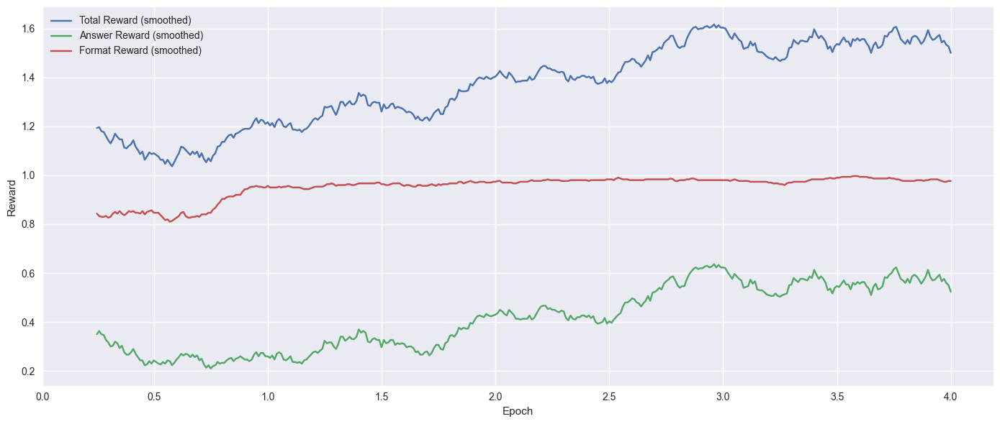
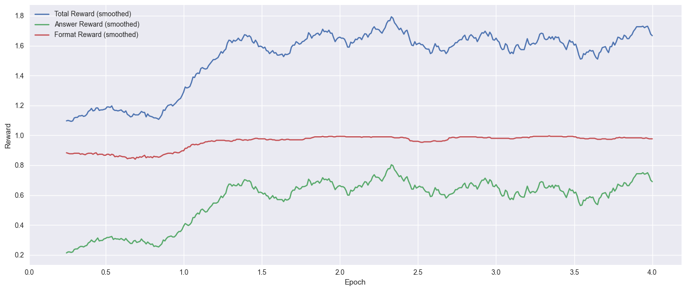
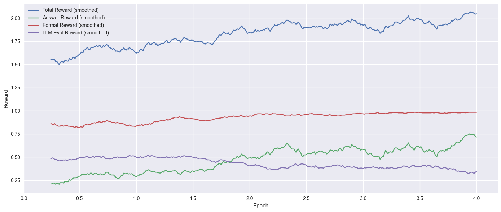
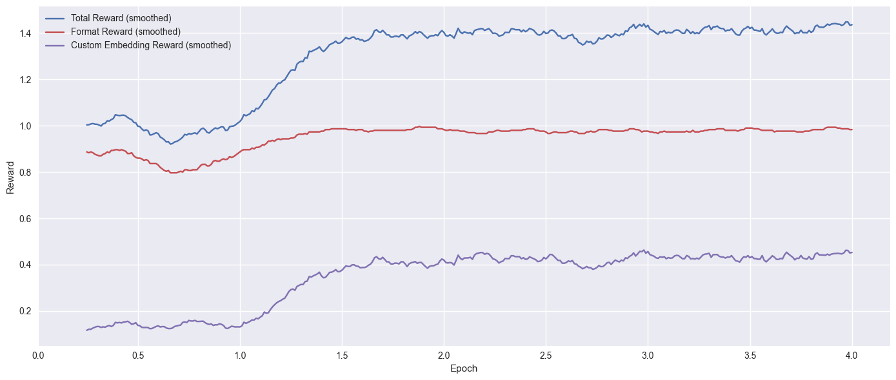

## 📊 Model Predictive Performance Results

| Model / Config   | Macro Avg F1 | Weighted F1 |
| ---------------- | ------------ | ----------- |
| Baseline         | 33.5%        | 37.1%       |
| Citations        | 45.6%        | 56.6%       |
| LLM Eval         | 52.7%        | 65.6%       |
| MedReason-Embed | 51.6%        | 65.6%       |
| SFT model        | 36.7%        | 56.2%       |
| LLaMA 405B       | 47.0%        | 53.7%       |

## 🤖 Model Reasoning Alignment and Training Efficiency

| Model / Config   | LLM-align score (/10) | NER Embedding F1 | Relative Training Time |
| ---------------- | --------------------- | ---------------- | ---------------------- |
| Base             | 5.64                  | 37.9%            | 1.0                    |
| Citations        | 7.28                  | 61.2%            | 1.2                    |
| LLM Eval         | 7.57                  | 65.4%            | 1.8                    |
| MedReason-Embed | 7.67                  | 65.5%            | 1.3                    |

### 🔍 Insights

**Context matters**: Adding high-quality medical evidence (Citations model) improves macro F1 by 12% over the baseline and boosts reasoning alignment significantly (23% gains in NER Embedding F1), without significantly increasing training time.  

**Reasoning rewards are effective**: LLM Eval and MedReason-Embed models, which are trained  with additional reasoning rewards to align with ACR reasoning, outperform standard SFT and even large pretrained models like LLaMA 405B, confirming that final-answer supervision alone is **insufficient** for medical reasoning.   

**Efficiency vs. performance**: The MedReason-Embed model with our own innovative reward function achieves performance  and reasoning abilities comparable to the LLM Eval model while being significantly more efficient—making it the most practical choice for deployment.   

**SFT and large models lag**: While the SFT and LLaMA 405B models improve over the baseline, they do not match the performance of reasoning-rewarded models, highlighting the limitations of general training approaches in clinical decision tasks and paving the way forward for RL adapted models.   

## Training curves and insights 
<table>
  <tr>
    <td><strong>BASELINE</strong> 
        
    </td>
    <td><strong>CITATIONS</strong> 
        
    </td>
  </tr>
  <tr>
    <td><strong>LLM EVAL</strong> 
        
    </td>
    <td><strong>MEDREASON-EMBED</strong> 
        
    </td>
  </tr>
</table>

### 📈 Training Curve Insights
**Format mastery is fast**: All models quickly learn to produce correctly formatted outputs, with format rewards stabilizing after ~1 epoch.   

**Baseline struggles**: The Baseline model shows unstable and slow answer reward improvement, reflecting weak learning signals and its limited medical knowledge.   

**Evidence helps early**: The Citations model exhibits a sharp reward jump by the end of the first epoch, demonstrating that adding medical evidence accelerates learning. However, reward experiences some noise in later epochs.   

**Multi-reward tension**: The LLM Eval model shows modest gains in answer reward but a decline in reasoning alignment reward, suggesting that multiple reward signals may interfere with learning stability and confuse the model despite high final overall performance.   

**MedReason-Embed excels**: This model shows the healthiest learning trajectory, with a sharp improvement after epoch 1 and smooth stabilization thereafter - an “aha moment” pattern often linked to emergent reasoning.   

**Learning ≠ stability**: Despite similar final scores, only some models (like MedReason-Embed) exhibit clear, interpretable learning dynamics, underscoring the importance of analyzing training curves—not just output metrics.   